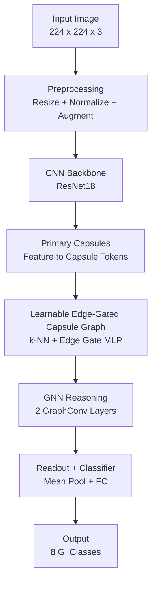

# CNN + CapsGNN Architecture

```mermaid
flowchart TD
    A[Input Image<br/>224 x 224 x 3]
    B[Preprocessing<br/>Resize + Normalize + Augment]
    C[CNN Backbone<br/>ResNet18]
    D[Primary Capsules<br/>Feature to Capsule Tokens]
    E[Learnable Edge-Gated Capsule Graph<br/>k-NN + Edge Gate MLP]
    F[GNN Reasoning<br/>2 GraphConv Layers]
    G[Readout + Classifier<br/>Mean Pool + FC]
    H[Output<br/>8 GI Classes]

    A --> B --> C --> D --> E --> F --> G --> H
```
